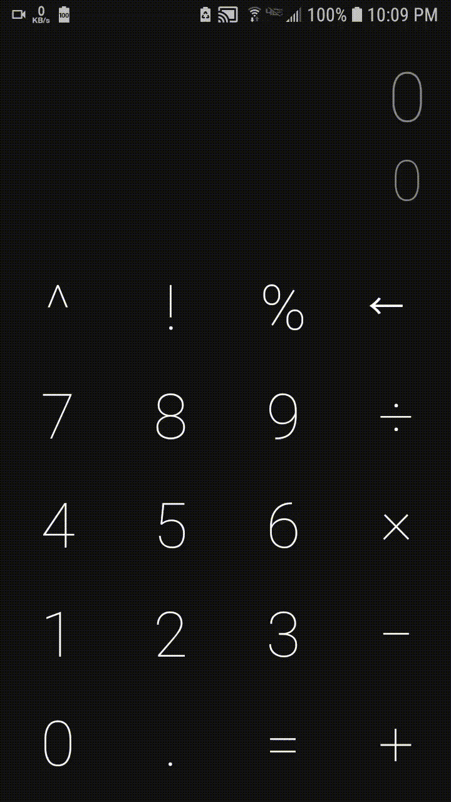
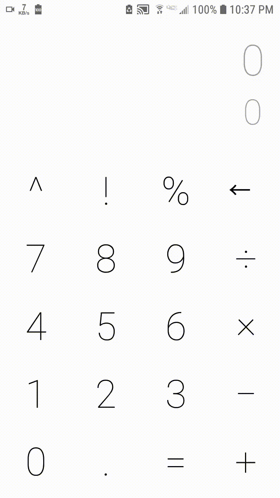
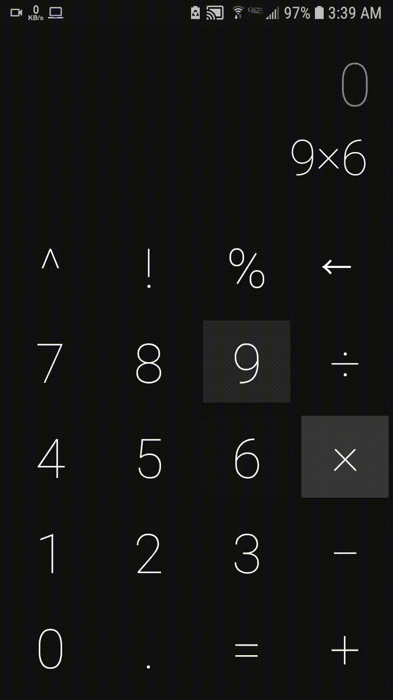

# Basic-Calculator
made a Simple Calculator in Android Studio using JAVA

* A Simple calculator App with the basic functions.

* Size of all text decreases as length of text increases.

* First row of buttons is scrollable, in it button of "√" is added.

* You can also copy the result or formula to clipboard by long pressing it.

* This App also changes night and light mode as per your phone's settings.

* You can swipe left to get the History tab to go through all calculations you made.

* Long pressing on the remove sign removes everything and sets everything to default.

## Example

