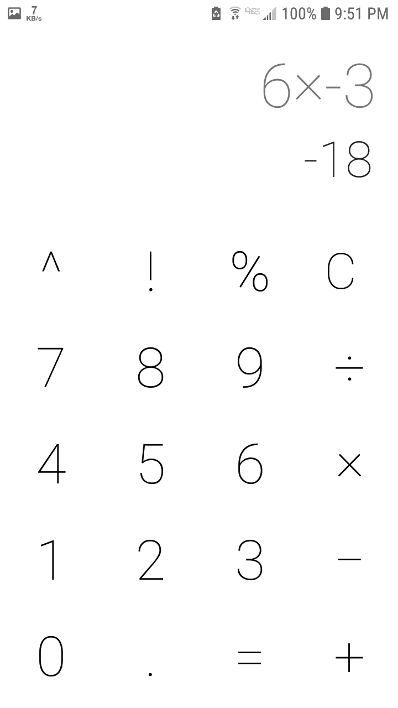
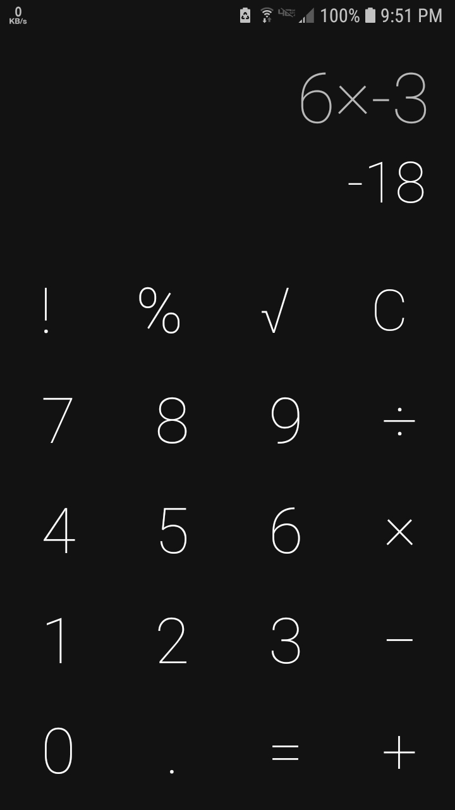

# Basic-Calculator
made a Simple Calculator in Android Studio using JAVA

A Simple calculator App with the basic functions.
You can also copy the result or formula to clipboard by long pressing it.

##Example

