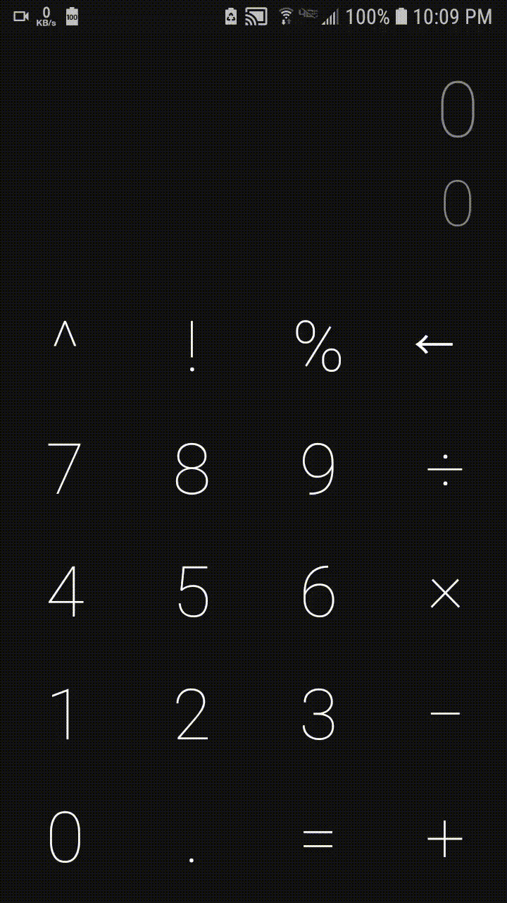

# Basic-Calculator
made a Simple Calculator in Android Studio using JAVA

* A Simple calculator App with the basic functions.

* You can also copy the result or formula to clipboard by long pressing it.

* This App also changes night and light mode as per your phone's settings.

## Example

